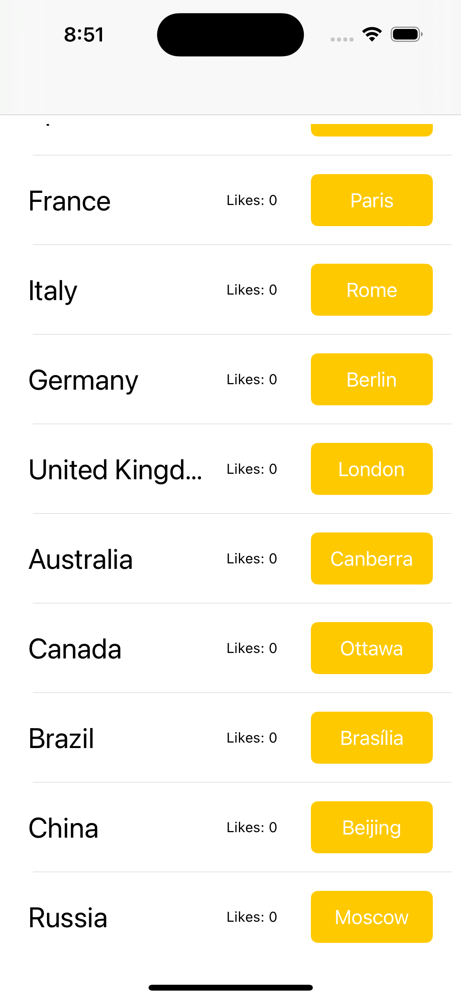
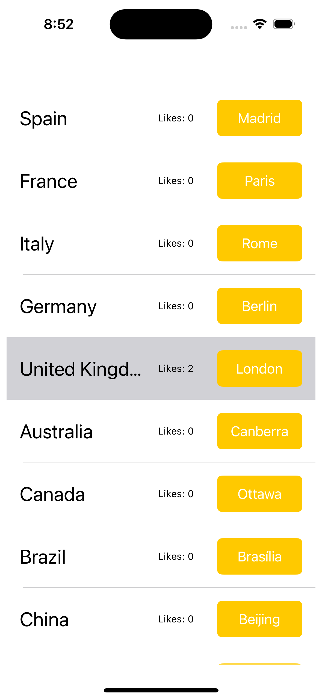

# CountryMapInsight

CountryMapInsight es una aplicación móvil que te permite explorar información sobre países y sus capitales utilizando mapas interactivos.

## Funcionalidades

- Visualización de una lista de países con información básica.
- Detalles de cada país, incluyendo nombre, capital y ubicación en el mapa.
- Posibilidad de ver detalles específicos de la capital de cada país.
- Contador de likes para cada país, con la capacidad de aumentarlos mediante interacción del usuario.

## Capturas de pantalla

## Instalación

Para probar la aplicación en tu dispositivo iOS, sigue estos pasos:

1. Clona este repositorio en tu máquina local.
2. Abre el proyecto en Xcode.
3. Conecta tu dispositivo iOS y selecciona tu dispositivo como destino de implementación.
4. Pulsa el botón de ejecución en Xcode para compilar y ejecutar la aplicación en tu dispositivo.

## Contribución

Si quieres contribuir a este proyecto, sigue estos pasos:

1. Haz un fork del repositorio.
2. Crea una nueva rama (`git checkout -b feature/nueva-funcionalidad`).
3. Realiza tus cambios y haz commits (`git commit -am 'Agrega nueva funcionalidad'`).
4. Haz push a la rama (`git push origin feature/nueva-funcionalidad`).
5. Abre un Pull Request.

## Tecnologías utilizadas

- Swift
- UIKit
- MapKit

## Créditos

Desarrollado por [Daniel].

## Licencia

Este proyecto está licenciado bajo la Licencia MIT - consulta el archivo [LICENSE.md](LICENSE.md) para más detalles.
